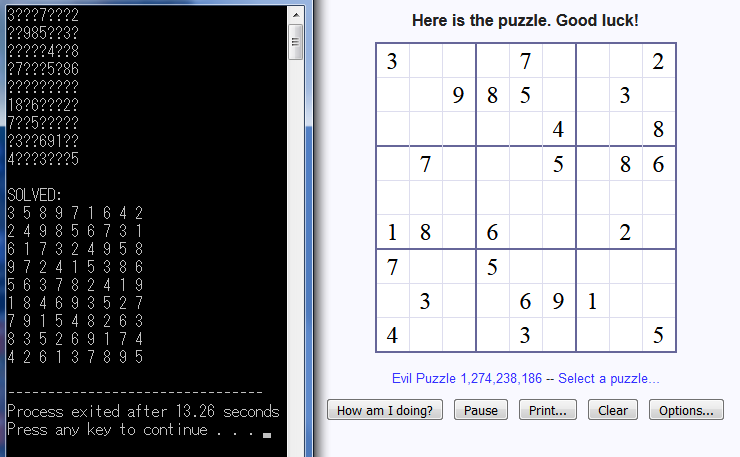
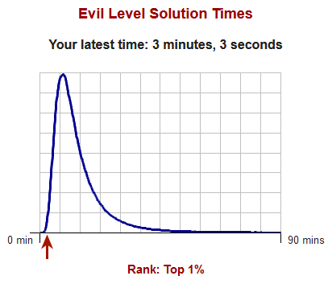

# SudokuSolver

This code solves your Sudoku Puzzle for you!

### Algorithm
Each cell in the 9 by 9 sudoku square is given a possibility vector (*possudoku[i][j]*) to store the possible numbers it can contain. 

If the initial value of a cell is given (say 2), it's possibility vector will be reduced to size 1 (containing only element 2), while any other possibility vector of cells in the same row, column or box will erase the particular value (2) from it.

The approach is then split into two portions.

#### Brute
If a cell's possibility vector has size 1, then it must be the value of the cell. Proceed by eliminating the value from all other cells in the same row, column or box. Repeat this step until one can find no more cells with possibility vector of size 1.

Note: It is possible for the sudoku puzzle to have no cells with possibility vector of size 1 and still be incomplete! (check sudokuerr1.txt)

#### Heuristic
We find the cell with the smallest possibility vector size, and we guess from here.

Whenever we guess, we push ('G', (x,y), value) into a vector vsearch. All deletions of values in possibility vectors as consequences of this search will also be pushed into vsearch in the form of ('C', (x,y), value).
Any confirmation of values as a consequence of this guess will be pushed into vsearch in the form of ('W', (x,y), value).

If we continued till the point when we need to make another guess, we continue pushing ('G', (x,y), value) into vsearch. If we reach a point where there is a contradiction, we backtrack till the point when we made the previous guess and update the acquired information.

### Time taken:
Generally takes around 0.1s for the complete solution.

The above result is 3+ minutes due to the time taken to extract information and keying them back.

### Possible extensions
- [x] Search algorithm for hard puzzles (can all sudoku puzzles be solved trivially? Ans: NO!)
- [x] Test algorithm against hard puzzles
- [ ] Handle the case when there is not enough information
- [x] File input / File output

### More details
Planned date of completion: 09/09/18
Actual date of completion : 29/08/18

Motivation: [PM Lee's posts Sudoku code](https://edition.cnn.com/2015/05/06/asia/singapore-pm-code-sudoku/index.html)